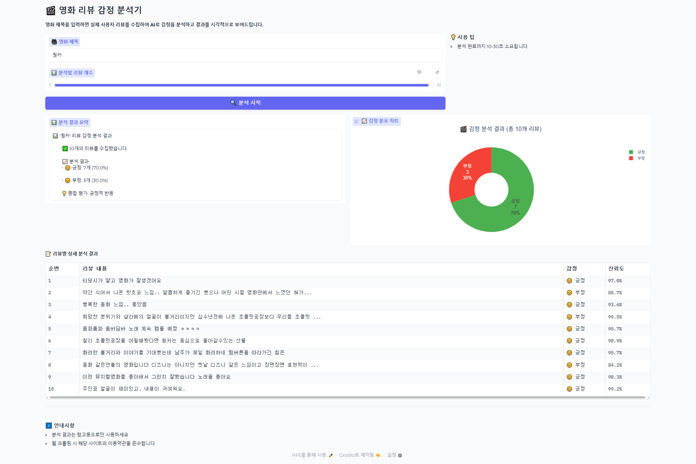

# 🎬 영화 리뷰 감정 분석기

## 1. 프로젝트 개요
- 한국어 감정 분석 ai 모델을 이용해 영화 리뷰에 대한 감정 분석을 수행하는 웹앱
- **Gradio**를 이용해 사용자 인터페이스를 제공
- **Hugging Face** 사전학습 모델을 활용해 별도 학습 없이 빠른 MVP 구현 가능
- 네이버 영화 리뷰를 크롤링하여 데이터 수집
- 리뷰 텍스트 기반으로 긍정/부정 감정 분포 분석 및 시각화




## 2. 주요 기능

#### 1. 영화 리뷰 수집
- 네이버 영화 평점 페이지에서 리뷰 크롤링
- Playwright를 이용해 셀레니움 없이 headless 브라우저 환경에서 실행 가능
- 최대 N개 리뷰를 수집 가능(10개로 제한)

#### 2. 감정 분석
- Hugging Face 사전학습 한국어 BERT/DistilBERT 계열 모델 사용
- 리뷰별 감정을 긍정 / 부정으로 분류
- 확률(score)도 함께 출력

#### 3. 결과 시각화
- Plotly를 사용하여 감정 분포 차트 생성
- Gradio Markdown과 Dataframe으로 분석 결과 출력

#### 4. 웹 앱 인터페이스
- Gradio Blocks 구조 사용
- Markdown 영역: 감정 분석 요약
- Plot 영역: 감정 분포 차트
- Dataframe 영역: 리뷰별 상세 분석 결과

## 3. 기술 스택

| 구분       | 기술                                                 |
| -------- | -------------------------------------------------- |
| 웹 인터페이스  | Gradio                                             |
| 감정 분석 모델 | Hugging Face Transformers (BERT / DistilBERT, 한국어) |
| 크롤링      | Playwright (headless Chromium), Selenium (2가지 버전)|
| 데이터 처리   | Pandas                                             |
| 시각화      | Plotly                                             |
| 배포       | Hugging Face Spaces (optional)                     |


## 4. 설치 및 실행 방법 (로컬)

#### 1. 가상환경 생성 및 활성화
```bash
python -m venv aivenv
source aivenv/Scripts/activate   # Windows
```

#### 2. 라이브러리 설치
```bash
pip install -r requirements.txt

```

#### 3. Playwright Chromium 설치
```bash
playwright install chromium
```

#### 4. 앱 실행
```bash
python app_playwright.py
```